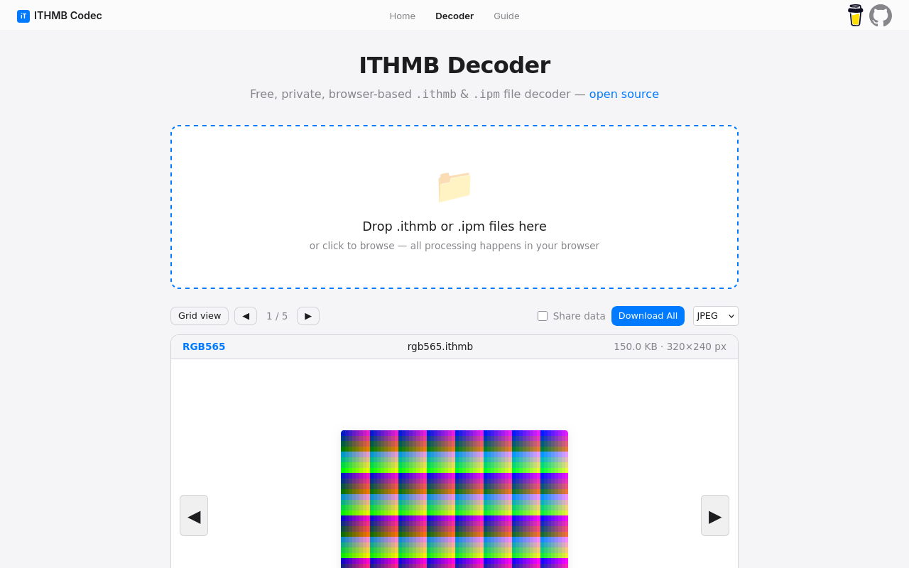

# ITHMB Codec Web

Free, private, browser-based .ithmb file decoder.

[**Try it live → ithmb-codec.dev**](https://ithmb-codec.dev/ithmb-decoder/)  |  [How to open .ithmb files (guide)](https://ithmb-codec.dev/guide/how-to-open-ithmb-files)

Built with AI assistance — see <a href="./docs/CREDITS.md">CREDITS.md</a>
 

 

ITHMB files are Apple iThumbnail images found in iPod Classic, iPod Nano, and other legacy Apple devices. They store thumbnail-sized album art, photos, and menu graphics that the iPod's UI reads directly from its disk. The format is undocumented and varies across devices and firmware versions. This project decodes them.

## Features

- **Free.** No cost, no signup, no account needed.
- **Private.** Everything runs in your browser via WebAssembly. Your files never leave
  your machine unless you explicitly opt in to contribute anonymous format data.
- **Batch decode.** Decode multiple .ithmb files at once.
- **Open source.** MIT licensed. Fork it, audit it, improve it.

## How to use

Go to [https://ithmb-codec.dev/ithmb-decoder/](https://ithmb-codec.dev/ithmb-decoder/) and drag your .ithmb files
onto the page. They decode instantly — no upload, no waiting. Download individual
images or grab them all as a ZIP archive.

## Support

Found an .ithmb file that doesn't decode? [Open an issue on the codec repo](https://github.com/B67687/Ithmb-Codec/issues).

Using ImageGlass? The [native .ithmb plugin](https://github.com/B67687/ImageGlass-Ithmb-Plugin) decodes files in-viewer without a browser.

Enjoying the tool? [Buy me a coffee](https://buymeacoffee.com/thumbnami).

## Built with

Rust, WebAssembly, and TypeScript.
